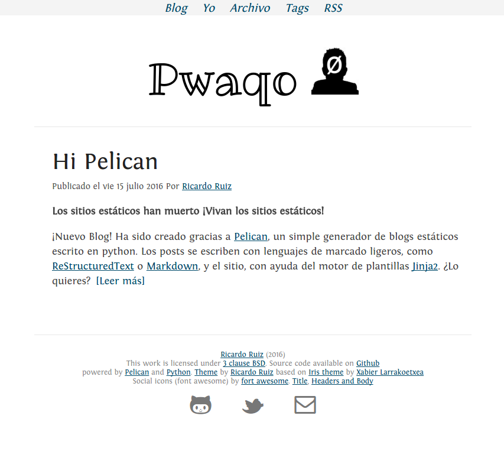

=====
Pupil
=====

What is pupil?
--------------

Pupil is a `pelican <http://getpelican.com>`_ theme based on `pupil theme <http://github.com/slok/pupil`_ 
This theme is very simple and easy to read, perfect for a minimalist blog without much things and
beautiful source code syntax (Thank you `pygments <http://pygments.org/>`_!)
Also uses various fonts:

- For social icons: `Font awesome <http://fortawesome.github.com/Font-Awesome/>`_
- For the title: `Ribeye Marrow <http://www.google.com/webfonts/specimen/Ribeye+Marrow>`_
- For the headers and body: `Fontin <http://www.exljbris.com/fontin.html>`_
- For the source code: Consolas

Preview
-------

Variables
---------

Some of the variables that could be used:

- ``DISPLAY_PAGES_ON_MENU``
- ``MENUITEMS`` : [('Archivo',ARCHIVES_URL),('Tags', TAGS_URL),('Contact', CONTACT_URL)]
- ``USER_LOGO`` : Image banner (Example 'profile.png')

- ``DISQUS_SITENAME``: For the disqus comments
- ``EMAIL``: For the email "mailto:"

For the analytics we have two flavours, one is Go `Squared <https://www.gosquared.com>`_

- ``GOSQUARED_SITENAME``: For the Go squared analytics

And the other is `Google analytics <https://www.google.com/analytics>`_ Google analytics has various forms. The
basic one is:

- ``GOOGLE_ANALYTICS_CODE``: this is the code of GA, something similar to: ``UA-xxxxxxxx-y``

If you have analytics across domains you can put this setting:

- ``GOOGLE_ANALYTICS_DOMAIN = ""``

And if you have upper domain level (com, org, co.uk...)

- ``GOOGLE_ANALYTICS_DOMAIN_UP = True``

- You can also integrate this theme with `Summary https://github.com/getpelican/pelican-plugins/tree/master/summary`_
  and `Read More Link https://github.com/getpelican/pelican-plugins/tree/master/read_more_link`_ plugins with the
  following configuration:

.. code-block: python

	PLUGINS = ['plugins.summary.summary', 'plugins.read_more_link.read_more_link']

	SUMMARY_END_MARKER = "<!-- readmore -->" # In rST .. readmore
	READ_MORE_LINK_FORMAT = "<a class='more' href='{url}'>{text}</a>"
	READ_MORE_LINK = '[Read More]'

Installation
------------

To install it, clone the repo and use pelican-themes. For example:

.. code-block: console
    
    $ git clone http://github.com/pwaqo/pupil.git
    $ pelican-themes -i pupil

Set the variable ``THEME`` to ``pupil`` in your pelican settings, like this::

    THEME = "pupil"

Notes
-----

The theme navigation bar does a fade in if you scroll more than 300 pixels to
increase the readability of an article.

License
-------

This theme is under the `3 clause BSD license <http://opensource.org/licenses/bsd-3-clause>`_
